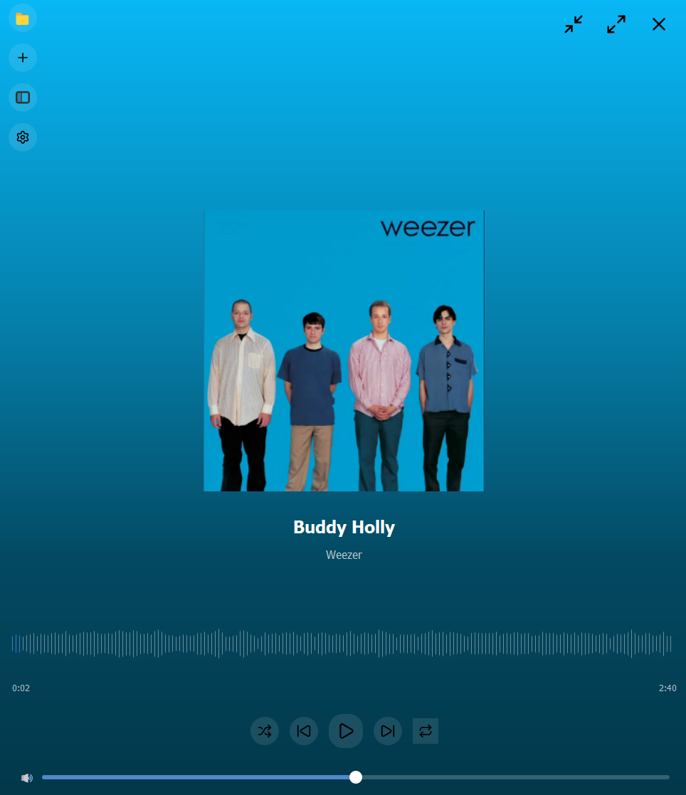
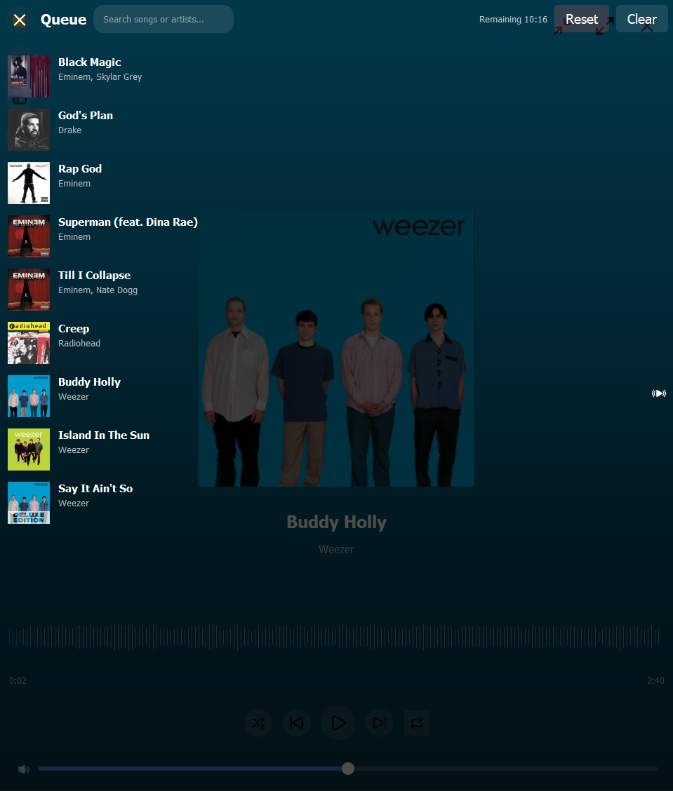
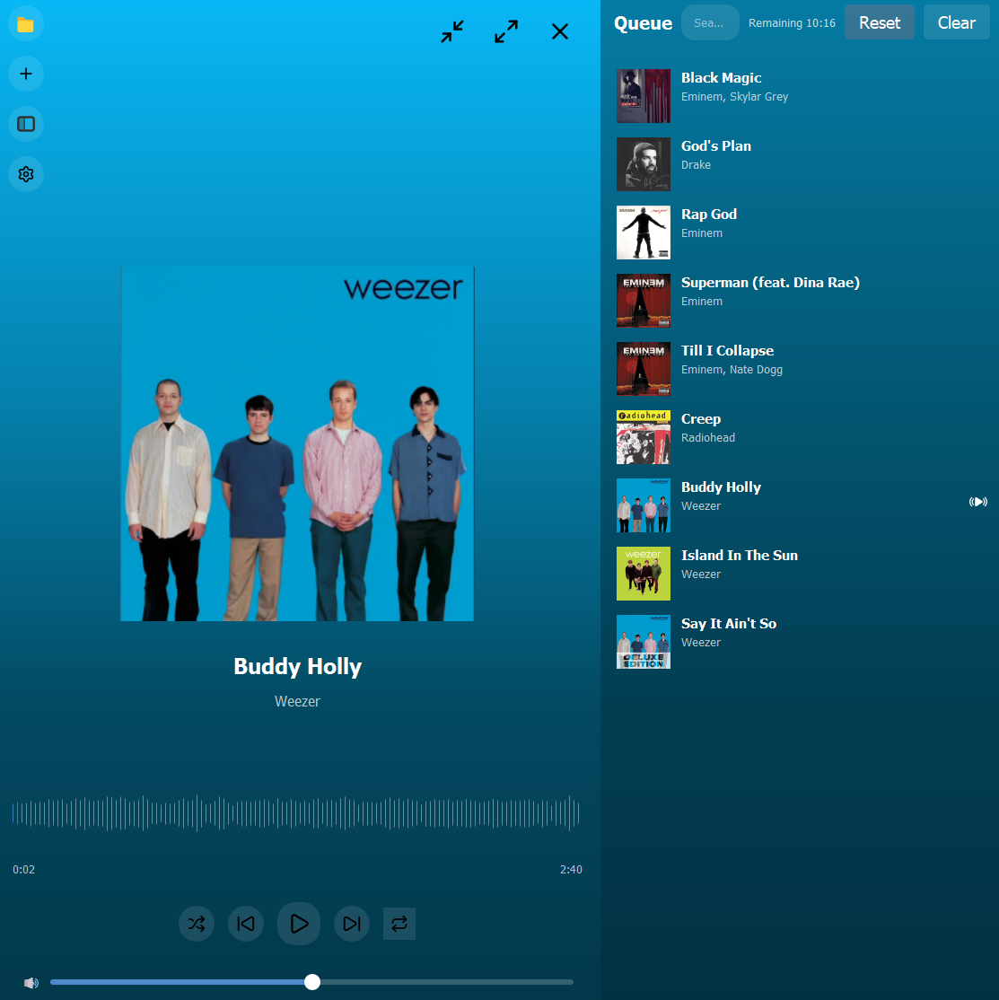
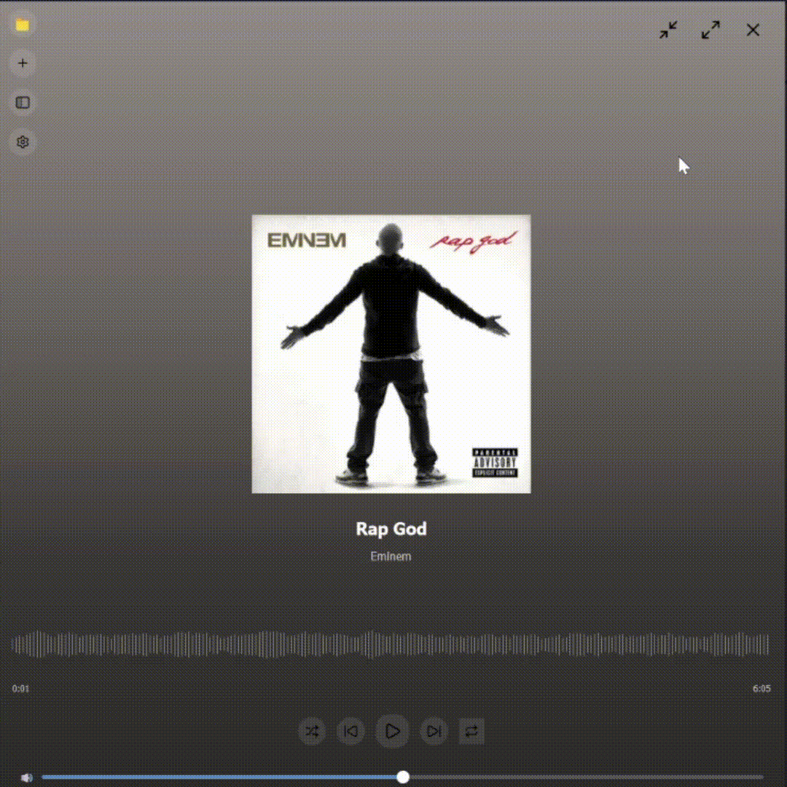

# Aurion music player 🎵

This project is heavily inspired by [Amberol](https://gitlab.gnome.org/World/amberol), and some icons from Amberol are used in this project.  
It’s designed to be a simple yet powerful music player with additional features like downloading music from YouTube Music.

---

## Features

- **Plays almost any music file** (depending on system codecs)  
- **Music downloader** powered by [yt-dlp](https://github.com/yt-dlp/yt-dlp) and [ytmusicapi](https://github.com/sigma67/ytmusicapi) for searching and downloading songs  
- **Crossfade songs** for smooth transitions  
- **Playback controls**: shuffle, repeat, skip, search by artist or name etc.  
- **Clean, intuitive UI** heavily inspired by Amberol  

---

## Requirements

### Windows

- Optional: Install the [K-Lite Codec Pack](https://www.codecguide.com/download_kl.htm) to support more music file formats  
- **FFmpeg** installed on your system(optional: only if you want to use the downloader)

### Other Operating Systems

- **FFmpeg** installed if you plan to use the downloader  
- Everything else should work out of the box  

---

## Running

### All operating systems

- download an executable from the [releases](https://github.com/GoldenLobster/Aurion/releases/latest)
- clone this repo, install dependencies(requirements.txt) and then run main.py

## Showcase

- Most icons are from [Lucide](https://lucide.dev/)  
- Some icons are from [Amberol](https://gitlab.gnome.org/World/amberol)  

  
  
  
  
  

